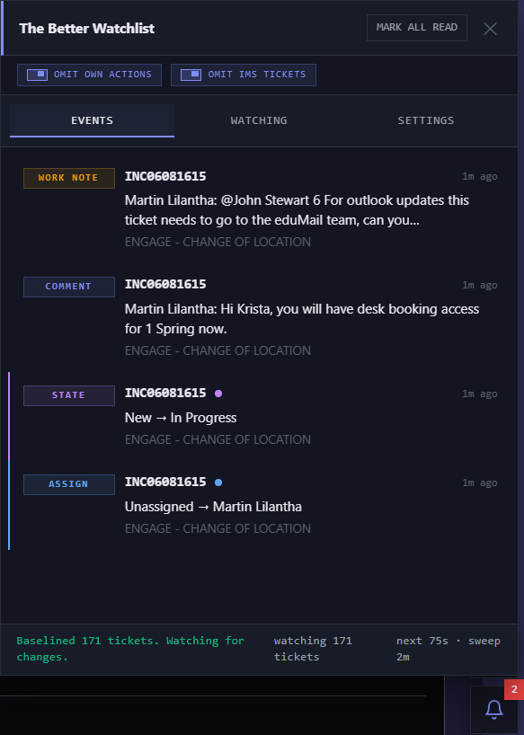

# Changelog

All notable changes to SOW Assistant Tools are documented here.

Reconstructed from development history. Dates are approximate.

## [5.0 UNRELEASED] - 2026-07-15

### New tool: The Better Watchlist

- Watches tickets you opened and toasts on group/assignee changes, state moves, resolutions with close notes, reopens, and customer comments, even after close
- Bell FAB launcher with unread badge counter (red, static number, no pulse animation)
- Full event panel with Events / Watching / Settings tabs, footer status bar with live status message, watching count, and next-poll countdown
- Click a browser notification or toast to open the panel focused on that event

### Watchlist: three-lane update architecture

- **Delta lane**: cheap per-table "changed since high water mark" queries every 15s (min 10s). 90-second HW overlap re-read with snapshot-diff dedupe, so nothing is missed at the boundary. Empty result on quiet polls means near-zero server and parse cost
- **Sweep lane**: full lookback reconciliation every 5 minutes (min 60s). Baselines new tickets, prunes snapshots that aged out of the lookback window, seeds a high water mark for empty tables so the delta lane picks up their first ticket immediately, and heals any drift the delta lane missed
- **Push lane**: AMB record watchers via the platform's own `g_ambClient` (`getRecordWatcherChannel`, channel format `/rw/default/<table>/<base64(filter)>`). Hand-built raw CometD subscriptions are denied by the instance, so the platform client is used, which also provides connection management for free
- Push events carry no trusted change detail, so they act as triggers only: debounced 800ms (bursts collapse), then the existing delta poll runs immediately. All diff, journal, toast, and persistence logic is identical in both lanes
- While push is live, the delta lane relaxes to a >=120s safety net; a 30-second watchdog flips lanes automatically if the AMB connection drops or recovers, with a heal poll on reconnect. Polling never stops entirely: the sweep lane remains the reconciliation source of truth
- Poll intervals get +/- jitter so several users on the same instance never sync up
- Tables fetched sequentially with small gaps so multiple JSON parses never land in the same frame (main-thread jank)

### Watchlist: comment detection rework (fixes the sys_journal_field blocker)

- Inline comment mode is now the **primary** path: `comments` and `work_notes` display values are refetched only for changed tickets and diffed against per-ticket seen sets, with baseline swallowing of history on first sight
- Verified by probe on 15/07/2026: the instance row-ACLs `sys_journal_field` to a silent-empty 200 (unfiltered `element_id` query returned 0 rows while comments and work notes read fine inline on the same ticket), so the unindexed time-range journal queries that were timing out are gone entirely
- The journal path is retained behind a mode flag for portability to instances that allow journal reads, with high-water-mark queries, 2-minute overlap, and a 500-entry seen-id dedupe cap
- SOW rich-text journal entries (`[code]
...
[/code]`) are cleaned before display

### Watchlist: event filtering and self-attribution

- "Omit own actions" and "Omit IMS tickets" switch chips in the panel header, both default on
- Own-action suppression uses AMB `changes_with_users` attribution: records changed exclusively by you are remembered briefly so the resulting field-change events are dropped; your own comments and work notes are filtered by author
- Omitting IMS skips the interaction table from polling and push subscriptions entirely, not just display. Re-enabling wipes stale interaction state and rebaselines silently on the next sweep instead of firing old changes

### Watchlist: diagnostics, resilience, persistence

- Session log: 500-entry ring buffer rendered as a live-appending terminal in the Settings tab, with Copy and Clear
- Settings: delta poll interval, full sweep interval, lookback window (30 days), toast lifetime (12s), browser notifications when tab hidden. Actions: Sweep Now. Maintenance: Clear Events, Reset + Rebaseline
- Rate limit handling: 429 responses bubble their Retry-After into the backoff, error toast shown after 2 consecutive failures, circuit-breaker backoff on repeated API failures
- Persistence writes are coalesced and pushed off the hot path via `requestIdleCallback` (serialising snapshots for a few hundred tickets on every poll was a measurable main-thread hit). State goes to localStorage with quota fallback and is mirrored into `sow_settings.json` through the toolkit's debounced auto-save
- Events capped at 200, seen journal ids at 500, snapshots pruned by lookback, so state cannot grow without bound
- Console API: `window.SOWTicketTracker.{pollNow, openPanel, amb, logs, state, destroy}`
- `prefers-reduced-motion` disables all watchlist animations

### Alert Suppressor V5: strategy rewrite + UI

- DOM insertion blocking is now the primary layer: `Node.prototype.insertBefore` / `appendChild` are intercepted and `now-alert` elements are hidden and removed before they ever function. No element means no timer, no dismiss clicking, no focus steal
- Event interception (`NOTIFICATIONS_UPDATED`) retained for message capture only, so blocked banners are logged with their real text
- Focus guard, CSS shadow-root nuke, and prototype-override layers removed; no longer needed with insertion blocking
- New shield FAB with blocked-count badge and a panel matching the watchlist design: timestamped BLOCKED log entries with sanitised message text, Clear Log
- FAB stacking coordination: the watchlist owns the bottom-right corner, the suppressor automatically moves above it when both are active

### Performance Boost: rework

- Blocks the `agentic_processing` endpoint (fails with a 400 every ~6 seconds) by returning a stubbed 200 from a fetch wrapper
- Kills all page CSS animations and transitions (0.001s durations) instead of throttling timers
- The toolkit menu is excluded from the animation kill so the neon border beam keeps its 6s duration instead of strobing

### Main menu restyle

- Restyled to match the watchlist and suppressor panels: sharp corners, `#131620` surface stack, mono section labels, accent-striped header, animated logo with pulsing nodes, v5 badge
- Animated neon border beam around the menu frame: a rotating conic-gradient layer. Isolation measures learned from previous CSS animation bugs: unique keyframe name injected once, animates `transform` only on a dedicated `pointer-events: none` layer (compositor thread, never triggers layout or paint outside it), frame uses `overflow: hidden` + `contain: layout paint style` + `isolation: isolate` so repaints are clipped and the beam cannot composite-blend with SOW's own stacking contexts, `display: none` stops the animation entirely, and `prefers-reduced-motion` kills it
- Gradient support retained for tools flagged `rainbow: true` (static purple-to-blue gradient: `#a855f7`, `#6366f1`, `#38bdf8`)

### Installer page

- Rebuilt as a single panel matching the toolkit's own design language: dark OKLCH surface stack (light mode reverted), accent-striped header, status bar footer, sentence case throughout, no uppercase microlabels
- Numbered tool ledger with per-tool colour stripes, JetBrains Mono, 4pt semantic spacing scale
- Drag button restyled as a scaled-up bordered chip with all 8 states designed (disabled/loading/error/success as class hooks)
- Tool count: 14. Footer: "v5 delta polling / settings persist to sow_settings.json"

---

## [4.0.1] - 2026-07-03

### Settings persistence rework

- File-picker-based save/load replaced with auto-syncing via File System Access API
- `sow_settings.json` created once via picker (defaults to Documents), then read/written silently
- IndexedDB persistence for the file handle so no re-picking needed across sessions

### Attachment Drop V2 edge case fix

- Fixed failure on unsaved "Create New Incident" tabs ("could not read ticket number" error)
- SOW pre-allocates a 32-char sys_id at form load; toolkit now detects it via passive XHR/fetch sniffing, shadow DOM component JS property walking, and Table API safety-check
- Native file input injection via DataTransfer for real-time panel refresh
- Tool disabled (`disabled: true`) pending further testing

### Installer page redesign

- Rounded-card AI aesthetic replaced with sharp-cornered terminal spec-sheet
- JetBrains Mono throughout, OKLCH colour custom properties, 4pt spacing scale
- Numbered tool ledger format, zero border-radius
- Switched to light mode
- Footer updated with link to `https://github.com/WolfStackSolutions`

---

## [4.0] - 2026-06-30

### New tool: Ticket Search

- Header-injected search bar inside `SN-POLARIS-HEADER` shadow DOM, mounted at `.polaris-header-controls`
- Dropdown of last 50 incidents, requests, and interactions belonging to the current user
- Filter-as-you-type across all three record types
- SPA navigation via `history.pushState` + synthetic `popstate` event (no page reload)
- All inline styles (shadow DOM boundary blocks external CSS)

### Settings persistence overhaul

- All `localStorage` and `sessionStorage` references removed entirely
- State routed through in-memory `window._sowToolkit.settings`
- Save/Load settings footer added with immediate UI reconciliation on Load
- `applyLoadedState` function and extracted `renderThemeToggle` helper for theme reconciliation

### Other changes

- Tool count updated to 13
- "(beta)" label removed from Quick Associate

---

## [3.5] - 2026-06-24

### New tool: Caller Insight

- Injects into `sn-contact-card` shadow DOM on IMS contact cards
- Fetches full `sys_user` record per caller employee number
- Parallel GETs for last 10 incidents, requests, and interactions
- 5-minute per-employee cache to avoid API spam on the 2.5s injection interval
- User card with name, edu_status/VIP/LOCKED/FAILED ATTEMPTS badges, title/department, email, phone, manager, last login, employee number copy chip
- Three collapsible sections (incidents blue, requests purple, interactions grey) with neon pulse on today's activity
- Click-to-copy ticket numbers with visual feedback
- Closed/complete states styled red, resolved states green
- `assigned_to` / `closed_by` / `resolved_by` fields displayed contextually

### Light/dark theme system

- Main toggle added between header separator and tool list (global override)
- Per-tool override buttons on Alert Suppressor V5, Tab Counter, Caller Insight, and Quick Associate
- Three-state cycle: auto (follows main) / force light / force dark
- `lt(key)` function checks per-tool overrides before falling back to global theme
- `cycleSingleTool(key)` tears down and reinitialises individual tools on override change

### Bug fixes

- Caller Insight `fDate()` function: added `year: 'numeric'` for dates older than 30 days
- Info text colours brightened from `#475569`/`#64748b` to `#94a3b8`/`#b4bcc8`

### Settings persistence

- `sessionStorage` remains runtime store; `localStorage` fallback for saved defaults on fresh session
- Save Startup Config / Update Startup Config button with green feedback
- Red X clear button (visible only when defaults exist)
- Export JSON / Import JSON for portability between machines

---

## [3.2] - 2026-06-12

### New tool: Quick Associate

- 11th tool, emerald dot
- Inline record association widget injected into IMS forms
- IMS number verification line displayed under "Associate Record"
- Uses same enable/disable plumbing as all other tools (cleanup on toggle-off)

---

## [3.1] - 2026-06-12

### Alert Suppressor HUD: draggable

- Header is the grab handle; drag to reposition anywhere on screen
- Clamped to viewport bounds
- 4px movement threshold separates drag from click
- Collapse/expand toggle excluded from drag starts
- Listeners added per-drag and removed on mouseup

### Tooltip Blocker: disabled in menu

- `disabled: true` flag added (greyed out at 35% opacity, not-allowed cursor, non-interactive toggle)
- Logic untouched, just visually benched pending fix
- Generic disabled handling works for any tool via the flag

---

## [3.0] - 2026-05-27

### New tool: Tooltip Blocker

- CSS-only suppression via `adoptedStyleSheets` in every shadow root
- `Element.prototype.attachShadow` interception for new shadow roots
- DOM insertion blocking approach was built but caused duplicate dots in SOW toolbar on tab switch (vDOM inconsistency) and broke the Genesys calling button; removed in favour of CSS-only
- `now-popover` blocking bug identified and fixed (was breaking interaction form fields)

### Auto-update CDN distribution system

- Bookmarklet converted to loader stub that fetches real toolkit from GitHub
- Version check on menu open: "checking version..." then "vX.X available" badge if newer commit found
- Hot-swap to latest version without re-install
- Moved from `raw.githubusercontent.com` to jsDelivr CDN, then to `sowcdn.wolfstacksolutions.net` for instant updates

### Installer page redesign

- Inter font, emerald green accent (`#10b981`), dark background (`#050508`)
- 5-column tool card grid with colour-coded dots
- Cleaner install card layout

---

## [2.0] - 2026-05-25

### Alert Suppressor V5 (complete rewrite)

- Layer 0 - Event interception: intercepts `dispatchEvent`, catches `NOTIFICATIONS_UPDATED` events, reads and logs notification messages as `INTERCEPTED`
- Layer 1 - Focus guard: monkey-patches `HTMLElement.prototype.focus` to block programmatic focus theft while typing; user clicks/tabs always pass through
- Layer 2 - CSS nuke: adopted stylesheets injected into every shadow root hiding all alert elements
- Layer 3 - Prototype + container nuke: `now-alert` connectedCallback overridden to self-destruct; `sn-uxf-page-notifications` container removed every sweep cycle
- Confirmed that network interception alone was insufficient (banners generated client-side by framework)

### New tool: Attachment Drop V2

- Drag-and-drop file attachment directly onto tickets without opening the attachment submenu
- Full-screen green "DROP TO ATTACH" overlay with target ticket shown
- Confirmation modal with editable file names (base name separate from extension), file type badges, sizes
- First file name auto-focused and selected for immediate rename
- Upload via ServiceNow Attachment API (`/api/now/attachment/upload`)
- `lockIframes()` on dragenter blocks Genesys iframe from detecting drag events
- Overlay set to `pointer-events: auto` to block drops from reaching work notes underneath

### Other changes

- Toast Tamer removed
- Menu UI redesigned with glassmorphism panel, JetBrains Mono, `backdrop-filter: blur(20px)`, colour-coded indicators, version badge
- Performance Boost tool added: throttles `setTimeout` (<50ms to 50ms) and `setInterval` (<200ms to 200ms)
- Genesys Timer idle state now shows live counting timer (time since last call ended) instead of static `--:--`
- Tool intervals optimised: everything except Alert Suppressor throttled to minimum 1s ticks

---

## [1.6] - 2026-05-01

### New tool: Genesys Timer

- Pill injected into SOW navbar showing live call phase
- Phases: idle / incoming / on-call / wrap-up
- Eavesdrops on `postMessage` traffic between Genesys embedded iframe and the page
- Colour progression during wrap-up: amber / orange / red flashing past 5 minutes
- Daily wrap-up budget tracking (15-minute default)
- Session call history (click to expand)
- Browser notification when wrap-up exceeds threshold (optional, tab-hidden only)
- Recursive shadow DOM traversal to locate the Genesys iframe

---

## [1.5] - 2026-04-29

### New tool: Lockout Check

- Injects "Check Lockout" buttons next to caller contact cards in SOW's shadow DOM
- Detects employee numbers via `input[name="caller_id.employee_number"]` for incidents and `now-label-value-pair` for interactions
- Opens prefilled popup to `userlockoutstatus.eduweb.vic.gov.au`
- Yellow "Stage" buttons for when the Details tab hasn't been visited (auto-clicks Details tab to load employee ID, then returns to previous tab)
- 2-second polling watcher for injection

### Other changes

- UI simplified to single drag target (SOW Toolkit button only); tool cards are descriptive only
- Alert Suppressor: CSS hard-hide fallback (`display:none!important`) after 20 failed click attempts
- Tool count: 6

---

## [1.1] - 2026-03-24

### New tools: Background Open + Tab Load Time

- Background Open: Shift+click any record link to open in background tab; polls and clicks home tab back into focus; tooltip near cursor showing ticket being opened
- Tab Load Time: measures tab switch speed with DOM mutation, JS execution (via PerformanceObserver), and paint breakdown; collapsible HUD bottom-left; average colour-coded green/amber/red

### SOW Toolkit all-in-one menu

- Single bookmarklet opens floating panel with on/off toggles for all tools
- `localStorage` persistence under `sow-toolkit-state`
- Click bookmark to toggle menu show/hide (no recreation)
- X button hides menu but tools keep running
- Proper cleanup on toggle-off

### Other changes

- `sessionStorage` added for navigation-survivable state
- Background Open: aggressive shadow walking on first activation (200ms, 500ms, 1s, 2s, then 3s interval)
- Alert Banner Bypass renamed to Alert Suppressor

---

## [1.0] - 2026-03-18

### Initial release

- **Alert Banner Bypass**: auto-dismisses ServiceNow notification banners via shadow DOM traversal, clicks "Dismiss alert" and "Dismiss All" buttons, hides `sn-uxf-page-notifications`
- **Ticket Copy**: adds clipboard icon to tabs matching ticket number patterns (INC, RITM, REQ, CHG, PRB, CTASK, SCTASK, STASK, TASK, IMS + 5 digits)
- **Tab Counter**: live `X / 10` counter in the tab bar, colour-coded blue/yellow/red by load

---

## Known disabled/benched tools

- **Tooltip Blocker**: disabled since v3.1 (CSS-only approach works but needs further testing after vDOM/popover bugs)
- **Attachment Drop V2**: disabled since v4.0.1 (unsaved record upload works but panel refresh needs polish)

## Explored but not shipped

- Databroker response cache (38% hit ceiling, real bottleneck is DOM rebuild)
- Tab caching limit increase (LRU eviction is internal to Seismic framework, no client-side knob)
- Console error fixes (all errors originate from ServiceNow platform code, require admin access)
- Tampermonkey `makeLRUCachePolicy` intercept (module export is non-configurable getter, 5 versions attempted)
- SOW theme engine v3 (RGB triplet format targeting ~60 foundational token variables)
- Raw CometD AMB subscriptions (denied unless base64-encoded; superseded by going through the platform's own `g_ambClient`)
